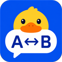

# TransDuck

TransDuck is a desktop translator for Windows and macOS. Select text in another
application, press a configurable hotkey, and receive a translation without
leaving the current task. It also provides screenshot OCR and manual-input
translation.

TransDuck supports Windows 10 x64 and macOS 14 or later on Intel x64 and Apple
Silicon arm64 Macs. The Windows release baseline is a single display.

## Highlights

- Translate selected text with the default platform hotkey: `Ctrl+Alt+D` on
  Windows or `Command+Option+D` on macOS.
- Capture a screen region and recognize Simplified Chinese or English locally
  before translating it.
- Enable one or more of Bing, Google, OpenAI-compatible, DeepL, Ollama, or
  Volcengine Translate and view each service's result separately.
- Use a user-supplied ECDICT CSV/SQLite dictionary on Windows or macOS; macOS can
  also query the active system dictionaries.
- Use the system proxy, a custom HTTP proxy, or a direct connection.
- Enable per-user login startup and keep the app available from the Windows
  notification area or macOS menu bar after closing its window.

## Install

TransDuck ships three self-contained ZIPs and has no installer or automatic
updater:

- Windows x64: `TransDuck-Windows-x64.zip`
- Intel Mac: `TransDuck-macOS-x64.zip`
- Apple Silicon Mac: `TransDuck-macOS-arm64.zip`

Extract the complete Windows ZIP before running `TransDuck.exe`. On macOS,
extract the complete ZIP and move `TransDuck.app` to its permanent location
before opening it.

See the [Windows guide](docs/user-docs/en/install-windows.md), the
[macOS guide](docs/user-docs/en/install-macos.md), or the corresponding
[Chinese Windows](docs/user-docs/zh/install-windows.md) and
[Chinese macOS](docs/user-docs/zh/install-macos.md) guides.

See [Local dictionaries and multiple translation results](docs/user-docs/en/dictionaries-and-multiple-results.md)
for source configuration and privacy details.

## Providers and data protection

TransDuck supports OpenAI-compatible, DeepL, Ollama, Volcengine Translate, and
built-in Bing and Google web translation. Bing and Google use unofficial web
interfaces rather than Azure Translator or Google Cloud Translation, so web
service or protocol changes can affect availability. Google web translation
needs no credential; a Bing Cookie is optional.

Selected text is sent separately to every enabled online provider. If only local
dictionaries are enabled, no online translation provider receives it. API keys,
Volcengine AK/SK, and an optional Bing Cookie are not written to ordinary
configuration files. Windows protects them with current-user DPAPI; macOS stores
them in the current user's Keychain. Other settings, translation history, and
diagnostics live under `%LocalAppData%\TransDuck` on Windows or
`~/Library/Application Support/TransDuck` on macOS, outside the application
directory.

TransDuck uses an original duck-and-bilingual-speech-bubbles icon. Multi-size
icon resources are embedded in the application and require no runtime download.

## Security notice

The release ZIPs are unsigned, and the macOS app is not notarized. Windows may
show publisher or SmartScreen warnings; macOS may show a Gatekeeper warning.
Verify the release source and use the operating system's supported Open or Open
Anyway flow. Do not disable security controls merely to bypass a warning.

## License

TransDuck is licensed under the [MIT License](LICENSE). Third-party licenses and
notices are included in each platform package.

## Release automation

Pushing any new tag to GitHub triggers the Release workflow. The Windows and
macOS builds, tests, packages, and audits must all pass before the matching
GitHub Release is created or updated with all three ZIPs.

## Development

Repository rules are in [AGENTS.md](AGENTS.md). The project is local by default:
do not configure a remote or push unless the user explicitly asks.

简体中文：[README.md](README.md)
